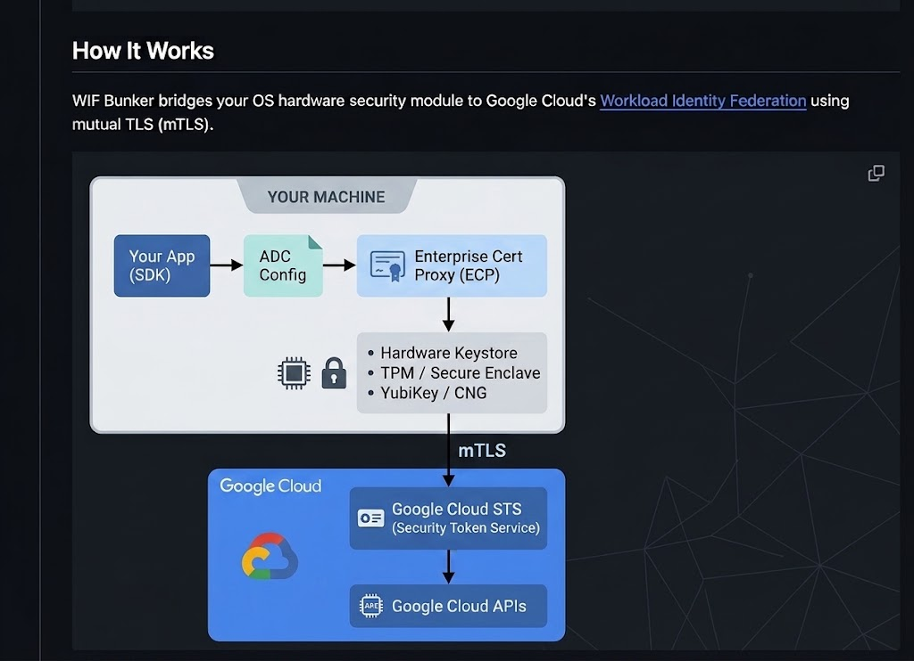

# WIF Bunker

**Hardware-backed Workload Identity Federation for Google Cloud**

WIF Bunker makes authenticating to Google Cloud as simple as downloading a service account key — but without the security risk. Instead of exportable JSON keys sitting on disk, your credentials are locked inside your machine's Trusted Platform Module (TPM), Secure Enclave, or YubiKey and can never be extracted.

One command. No key files. No secrets to rotate.

```bash
wif-bunker --create-project my-project --gcp-folder 123456789
```

This single command:
1. Creates a GCP project and enables required APIs
2. Generates a non-exportable private key on your device's hardware security module
3. Creates a Workload Identity Federation pool with X.509 certificate authentication
4. Configures [Application Default Credentials (ADC)](https://cloud.google.com/docs/authentication/application-default-credentials) for seamless `gcloud` and SDK usage
5. Verifies the full chain end-to-end: hardware key → mTLS → Google STS → API call

## Why WIF Bunker?

| | Service Account Keys | WIF Bunker |
|---|---|---|
| **Key location** | 🔴 JSON file on disk (exportable) | 🟢 Hardware security module (non-exportable) |
| **Risk if stolen** | 🔴 Full impersonation | 🟢 Key cannot be extracted |
| **Rotation** | 🔴 Manual, error-prone | 🟢 Re-run before expiry (max 390 days) |
| **Setup complexity** | Download a file | One command |
| **Compliance** | 🔴 Fails most security audits | 🟢 Hardware-backed identity |
| **Attestation** | 🔴 None | 🟢 Cryptographic proof of hardware residency |

## Supported Hardware

| Platform | Hardware | Algorithms |
|---|---|---|
| **Linux** | TPM 2.0 | ES256, ES384, RSA 2048/3072/4096¹ |
| **macOS** | Secure Enclave (Apple Silicon) | ES256, ES384² |
| **Windows** | TPM 2.0 | ES256, ES384, RSA 2048/3072/4096¹ |
| **Cross-platform** | YubiKey 5 ([PIV](https://csrc.nist.gov/pubs/fips/201-3/final)) | ES256, ES384, RSA 2048 (4096 on fw 5.7+) |

¹ RSA algorithm support varies by TPM manufacturer and model. Most TPMs support RSA 2048; RSA 3072 and 4096 are common but not universal. Use `wif-bunker --supported-algorithms` to query your hardware.
² EC-only is a hardware constraint of the Apple Secure Enclave, which does not support RSA key generation.

## Installation

### Linux / macOS (one-liner)

**Linux prerequisites:** TPM 2.0 hardware (or [swtpm](https://github.com/stefanberger/swtpm) for development) and the TPM PKCS#11 toolchain:

```bash
sudo apt install tpm2-tools libtpm2-pkcs11-1 libtpm2-pkcs11-tools python3-tpm2-pkcs11-tools gnutls-bin opensc
```

**macOS prerequisites:** macOS 15 (Sequoia) or later with Apple Silicon (Secure Enclave).

**YubiKey prerequisites (any OS):** YubiKey 5 series with firmware 5.0+. On Linux, `pcscd` must be running (`sudo apt install pcscd`).

```bash
bash <(curl -s -S -L https://raw.githubusercontent.com/jay0lee/wif-bunker/master/packaging/install.sh)
```

This downloads the latest release, extracts it to `~/bin/wif-bunker`, and adds it to your `PATH`.

Options:
```bash
# Install a specific version
bash <(curl -s -S -L https://raw.githubusercontent.com/jay0lee/wif-bunker/master/packaging/install.sh) -v v2026.08.03.0024

# Install to a custom directory
bash <(curl -s -S -L https://raw.githubusercontent.com/jay0lee/wif-bunker/master/packaging/install.sh) -d /opt/wif-bunker

# Upgrade only (skip PATH setup)
bash <(curl -s -S -L https://raw.githubusercontent.com/jay0lee/wif-bunker/master/packaging/install.sh) -l
```

### Windows

**Prerequisites:** TPM 2.0 — present on all Windows 11 PCs.

Download and run the installer from the [Releases](https://github.com/jay0lee/wif-bunker/releases) page:

| Download | Hardware |
|---|---|
| `wif-bunker-VERSION-windows-x86_64-setup.exe` | TPM 2.0 |

The installer adds `wif-bunker` to your PATH automatically.

### Verify (optional)

All release artifacts are code-signed, notarized, and include build provenance attestations. See **[Verifying a WIF Bunker Build is Legitimate and Official](https://github.com/jay0lee/wif-bunker/wiki/Verifying-a-WIF-Bunker-Build-is-Legitimate-and-Official)** for full details.

Quick verification:

```bash
# Verify SHA-256 checksums
sha256sum -c SHA256SUMS.txt

# Verify build provenance (requires GitHub CLI)
gh attestation verify wif-bunker-*.tar.gz -R jay0lee/wif-bunker
```

## Quick Start

### 1. Authenticate to Google Cloud

WIF Bunker needs a Google identity to create GCP resources on your behalf. Use one of:

```bash
# Option A: Browser-based OAuth (interactive)
wif-bunker --create-project my-wif-project --gcp-folder FOLDER_ID

# Option B: Application Default Credentials (CI/CD)
# See: https://cloud.google.com/docs/authentication/application-default-credentials
wif-bunker --use-adc --create-project my-wif-project --gcp-folder FOLDER_ID
```

### 2. Set environment variables

After setup, WIF Bunker prints the environment variables needed for [ADC](https://cloud.google.com/docs/authentication/application-default-credentials):

```bash
export GOOGLE_APPLICATION_CREDENTIALS=/path/to/wif-bunker/adc.json
export GOOGLE_API_USE_CLIENT_CERTIFICATE=true
export GOOGLE_API_CERTIFICATE_CONFIG=/path/to/wif-bunker/certificate_config.json
```

### 3. Use Google Cloud normally

Any Google Cloud SDK or client library that supports [ADC](https://cloud.google.com/docs/authentication/application-default-credentials) will now authenticate using your hardware-backed identity:

```python
import google.auth

credentials, project = google.auth.default()
# Authenticated via hardware-backed mTLS — no key files involved
```

## Modes

WIF Bunker supports several operational modes beyond the default full-provisioning workflow.

### Certificate-only mode

Generate a hardware-backed certificate without creating any GCP resources. Useful for testing your hardware keystore or using the certificate with non-GCP services:

```bash
wif-bunker --cert-only --output-dir /tmp/certs
```

### mTLS smoke test

Generate a certificate and validate the full mTLS signing pipeline against external test endpoints — no GCP credentials needed:

```bash
wif-bunker --cert-and-mtls-test --output-dir /tmp/test
```

This tests TLS handshakes against `certauth.idrix.fr` (requires client certs) and `sts.mtls.googleapis.com` (accepts client certs), verifying your hardware key can sign TLS connections end-to-end.

### Status check

Inspect your current configuration, certificate expiry, and connectivity:

```bash
wif-bunker --status
```

Reports configuration file status, certificate metadata and expiration (warns at <15 days, errors if expired), hardmTLS cert retrieval, and performs a live ADC API call to verify authentication.

### Diagnostics

Dump all version info, dependency versions, environment variables, and system details — useful for bug reports:

```bash
wif-bunker --all-versions
```

### Query supported algorithms

Ask the active keystore what algorithms it supports:

```bash
wif-bunker --supported-algorithms          # one per line
wif-bunker --supported-algorithms --debug  # verbose table
```

## YubiKey Support

WIF Bunker supports YubiKey 5 series devices as a cross-platform hardware keystore using the PIV (Personal Identity Verification) applet. This is ideal for:

- **Portable credentials** — move your hardware-backed identity between machines
- **Air-gapped environments** — use a removable token instead of a platform TPM
- **Shared workstations** — each user plugs in their own YubiKey

### Basic usage

```bash
# Use the platform TPM/Secure Enclave (default, no flag needed)
wif-bunker --create-project my-project --gcp-folder 123456789

# Use a YubiKey instead
wif-bunker --use-yubikey --create-project my-project --gcp-folder 123456789
```

### Multiple YubiKeys

If multiple YubiKeys are connected, specify which one:

```bash
wif-bunker --use-yubikey --yubikey-serial 20602167 --create-project my-project --gcp-folder 123456789
```

### PIV slots

By default, WIF Bunker uses slot `9a` (Authentication). You can use other PIV slots:

| Slot | Name | Use case |
|---|---|---|
| `9a` | Authentication | Default. General-purpose authentication |
| `9c` | Digital Signature | Non-repudiation signing |
| `9d` | Key Management | Encryption/decryption |
| `9e` | Card Authentication | Contactless authentication |

```bash
wif-bunker --use-yubikey --yubikey-slot 9c --create-project my-project --gcp-folder 123456789
```

### Touch policy

Control whether physical touch is required for cryptographic operations:

| Policy | Behavior | Use case |
|---|---|---|
| `never` | No touch required (default) | Headless servers, CI/CD |
| `cached` | Touch once per 15 seconds | Interactive with convenience |
| `always` | Touch for every operation | Maximum security |

```bash
wif-bunker --use-yubikey --yubikey-touch-policy cached --create-project my-project --gcp-folder 123456789
```

## Hardware Attestation

WIF Bunker can generate **cryptographic proof** that your private key lives in hardware and was never exposed to software. This is useful for compliance audits, zero-trust policies, and security reviews.

```bash
# Generate a cert, then attest it
wif-bunker --cert-only --output-dir /tmp/certs
wif-bunker --attest --cert-file /tmp/certs/workload_cert.pem --output-dir /tmp/attestation
```

### What attestation proves

| Check | Linux (TPM) | Windows (TPM) | YubiKey |
|---|---|---|---|
| Key generated in hardware | ✓ | ✓ | ✓ |
| Key is non-exportable | ✓ | ✓ | ✓ |
| Manufacturer chain of trust | ✓ | ✓ | ✓ |
| Device model/serial | ✓ | — | ✓ |
| Firmware version | — | — | ✓ |
| PIN/touch policy | — | — | ✓ |

> **Note:** macOS Secure Enclave does not expose attestation APIs. Apple's security model relies on the Secure Enclave's hardware design rather than certificate-based attestation.

### Attestation output

The `--attest` flag writes attestation artifacts (certificates, TPM quotes) to the output directory and prints a verification report:

```
=== Hardware Key Attestation ===
  ✓ Key generated on hardware (YubiKey 5C, serial 35270891, firmware 5.7.4)
  ✓ Key is non-exportable (touch: never, PIN: once)
  ✓ Attestation chain verified against Yubico Root CA
  ✓ Form factor: USB-C Keychain
  All 4/4 attestation checks passed (yubikey-piv)
```

## How It Works

WIF Bunker bridges your OS hardware security module to Google Cloud's [Workload Identity Federation](https://cloud.google.com/iam/docs/workload-identity-federation) using mutual TLS (mTLS).



### The Setup Flow

| Step | What happens |
|------|-------------|
| **1. Project** | Creates (or reuses) a GCP project and enables IAM, STS, and CRM APIs |
| **2. Certificate** | Generates a non-exportable private key in your hardware security module and creates an ephemeral CA to sign it |
| **3. WIF Pool** | Creates a Workload Identity Federation pool with an X.509 provider, pinned to your certificate's fingerprint |
| **4. IAM** | Grants the federated identity permission to act on the project (optionally via a service account) |
| **5. ADC Config** | Writes `adc.json` and `certificate_config.json` that tell google-auth how to use hardmTLS for signing |
| **6. Verification** | Validates the full chain: hardware key → hardmTLS → mTLS → Google STS → API call |

### hardmTLS — the signing engine

WIF Bunker ships **hardmTLS**, an open-source Rust shared library (`libhardmtls.so` / `libhardmtls.dylib` / `hardmtls.dll`) that performs all TLS client certificate operations. It implements the [Enterprise Certificate Proxy (ECP)](https://cloud.google.com/endpoint-verification/docs/ecp-overview) C-API interface and talks directly to your OS hardware keystore:

| Platform | Backend |
|---|---|
| Linux | `tpm2-pkcs11` PKCS#11 interface |
| macOS | CryptoTokenKit / Secure Enclave |
| Windows | Platform Crypto Provider (CNG/NCrypt) |
| YubiKey | Native PIV bindings |

The private key never leaves the hardware — hardmTLS sends the data to be signed *to* the hardware module and receives only the signature back.

### Platform Details

<details>
<summary><strong>Windows — TPM 2.0</strong></summary>

- **Key generation:** `certreq -new` with `Microsoft Platform Crypto Provider`
- **Key storage:** Windows certificate store (non-exportable, TPM-bound)
- **Certificate store:** `CurrentUser\My`
- **Supported algorithms:** ECDSA P-256, ECDSA P-384, RSA 2048/3072/4096
- **Attestation:** Full TPM attestation with Attestation Identity Key (AIK) quotes

</details>

<details>
<summary><strong>macOS — Secure Enclave via CryptoTokenKit</strong></summary>

- **Key generation:** `sc_auth create-ctk-identity` (CryptoTokenKit)
- **Key storage:** Secure Enclave (non-exportable, hardware-fused)
- **Certificate store:** Login keychain (`login.keychain-db`)
- **Supported algorithms:** ECDSA P-256, ECDSA P-384 (Secure Enclave constraint)
- **Attestation:** Not supported (Apple does not expose Secure Enclave attestation APIs)
- **Requires:** macOS 15 (Sequoia) or later, Apple Silicon

</details>

<details>
<summary><strong>Linux — TPM 2.0 via PKCS#11</strong></summary>

- **Key generation:** `tpm2_ptool addkey` (tpm2-pkcs11)
- **Key storage:** TPM 2.0 PKCS#11 store (`~/.tpm2_pkcs11`)
- **Tools required:** `tpm2-tools`, `libtpm2-pkcs11-tools`, `python3-tpm2-pkcs11-tools`, `gnutls-bin`, `opensc`
- **Attestation:** Full TPM 2.0 attestation — Endorsement Key (EK) certificate chain, key certification, manufacturer provenance
- **Supported algorithms:** ECDSA P-256, ECDSA P-384, RSA 2048/3072/4096
- **Development:** Supports [swtpm](https://github.com/stefanberger/swtpm) (software TPM) for testing without hardware

</details>

<details>
<summary><strong>YubiKey — PIV applet (cross-platform)</strong></summary>

- **Key generation:** `ykman piv keys generate` (on-device, non-exportable)
- **Key storage:** YubiKey PIV applet (hardware-bound, survives resets)
- **Supported algorithms:** ECDSA P-256, ECDSA P-384, RSA 2048, RSA 4096 (firmware 5.7+)
- **Attestation:** PIV key attestation with chain verification against bundled Yubico Root CAs. Reports device model, serial number, firmware version, form factor, PIN/touch policy.
- **Firmware requirement:** 5.0 or later for PIV attestation
- **PIV slots:** 9a (Authentication, default), 9c (Signature), 9d (Key Management), 9e (Card Auth)
- **Touch policy:** `never` (default), `cached` (15s), `always`
- **Works on:** Linux (requires `pcscd`), macOS, Windows

</details>

## CLI Reference

```
wif-bunker [OPTIONS]
```

### Modes

| Flag | Description |
|------|-------------|
| *(default)* | Full provisioning: project → certificate → WIF pool → IAM → ADC config → verify |
| `--cert-only` | Generate a hardware-backed certificate without GCP setup |
| `--cert-and-mtls-test` | Generate a certificate and test mTLS handshakes (no GCP credentials needed) |
| `--status` | Show configuration status, certificate expiry, and test connectivity |
| `--attest` | Generate hardware attestation artifacts proving keys reside in hardware |
| `--supported-algorithms` | Query the active keystore for supported key algorithms |
| `--all-versions` | Print version info, dependencies, and system details for bug reports |

### Project

| Flag | Description |
|------|-------------|
| `--create-project NAME` | Create a new GCP project with this ID |
| `--use-project ID` | Use an existing GCP project |
| `--gcp-folder ID` | Parent folder for project creation |

### Identity

| Flag | Description |
|------|-------------|
| `--create-service-account NAME` | Create a service account (default: `bunker-wif-sa`) |
| `--use-service-account EMAIL` | Use an existing service account |
| `--no-service-account` | Authenticate directly as the WIF principal (no SA impersonation) |

### WIF Pool

| Flag | Description |
|------|-------------|
| `--create-pool NAME` | Create a WIF pool (default: `bunker-wif-pool`) |
| `--use-pool NAME` | Use an existing WIF pool |

### Authentication

| Flag | Description |
|------|-------------|
| `--use-adc` | Use [Application Default Credentials](https://cloud.google.com/docs/authentication/application-default-credentials) (for CI/CD) |
| `--client-secrets-file FILE` | OAuth client secrets file (for interactive use) |

### Key Options

| Flag | Description |
|------|-------------|
| `--key-algorithm ALGO` | `es256` (default), `es384`, `rsa2048`, `rsa3072`, `rsa4096` |
| `--cert-lifetime DAYS` | Certificate validity in days (1–390, default: 90) |
| `--output-dir DIR` | Output directory for `--cert-only`, `--cert-and-mtls-test`, or `--attest` artifacts |
| `--cert-file PATH` | Path to workload certificate PEM (used with `--attest`) |
| `--debug` | Enable verbose debug logging |
| `--version` | Show version |

### YubiKey Options

| Flag | Description |
|------|-------------|
| `--use-yubikey` | Use a YubiKey PIV device instead of the platform TPM/Secure Enclave |
| `--yubikey-serial SERIAL` | YubiKey serial number (required if multiple YubiKeys are connected) |
| `--yubikey-slot {9a,9c,9d,9e}` | PIV slot for the workload key (default: `9a`) |
| `--yubikey-touch-policy {never,cached,always}` | Touch policy (default: `never`) |

## Reusing Existing Resources

WIF Bunker supports reusing previously created resources for re-provisioning or multi-machine setups:

```bash
# Reuse existing project, pool, and service account
wif-bunker \
  --use-project my-wif-project \
  --use-pool bunker-wif-pool \
  --use-service-account bunker-wif-sa@my-wif-project.iam.gserviceaccount.com
```

## Certificate Rotation

By default, WIF Bunker certificates expire after 90 days. GCP Workload Identity Federation enforces a **maximum certificate lifetime of 390 days**. Before your certificate expires, re-run WIF Bunker with `--use-project` and `--use-pool` to generate a new hardware-backed key and update the WIF provider:

```bash
wif-bunker \
  --use-project my-wif-project \
  --use-pool bunker-wif-pool \
  --use-service-account bunker-wif-sa@my-wif-project.iam.gserviceaccount.com
```

This generates a fresh certificate and replaces the old WIF provider trust anchor and fingerprint pin. The old key remains in the hardware keystore but is no longer trusted by GCP.

You can check remaining validity at any time with `wif-bunker --status`, and adjust lifetime with `--cert-lifetime`:

```bash
# 180-day certificate
wif-bunker --create-project my-project --gcp-folder 123456 --cert-lifetime 180
```

## CI/CD Integration

WIF Bunker works in CI/CD pipelines using `--use-adc`. Example with GitHub Actions:

```yaml
- uses: google-github-actions/auth@v3
  with:
    workload_identity_provider: projects/PROJECT_NUM/locations/global/workloadIdentityPools/POOL/providers/PROVIDER
    service_account: SA@PROJECT.iam.gserviceaccount.com

- name: Run WIF Bunker
  run: |
    wif-bunker \
      --use-adc \
      --use-project my-project \
      --use-pool bunker-wif-pool \
      --use-service-account sa@my-project.iam.gserviceaccount.com
```

## Dependencies

WIF Bunker currently requires a **forked version** of one Google library because the upstream release does not fully support hardware-backed (non-exportable) keys:

### google-auth (Python)

The upstream [`google-auth`](https://github.com/googleapis/google-auth-library-python) library assumes that both a certificate *and* a private key file are present on disk when configuring mutual TLS (mTLS). With hardware-backed keys, the private key lives inside the TPM or Secure Enclave and is never available as a file — only hardmTLS can perform signing operations. WIF Bunker uses a [forked google-auth](https://github.com/jay0lee/google-cloud-python) that tolerates a missing `key_path` in the certificate configuration and delegates all TLS signing to the hardmTLS library.

**Upstream issue:** [googleapis/google-cloud-python#17967](https://github.com/googleapis/google-cloud-python/issues/17967)

> **Note:** Once this upstream issue is resolved, WIF Bunker will switch to the official release. No changes to your configuration will be required.

## Security

- **Non-exportable keys:** Private keys are generated inside the hardware security module and cannot be read or copied by any software, including WIF Bunker itself.
- **Hardware attestation:** Cryptographic proof that keys reside in hardware, verifiable against manufacturer root CAs (TPM vendors, Yubico).
- **Certificate fingerprint pinning:** The WIF provider's `attributeCondition` pins authentication to the exact certificate fingerprint, preventing use of other certificates signed by the same CA.
- **Ephemeral CA:** The CA that signs the workload certificate exists only in memory during setup. It is never written to disk.
- **Good citizen:** WIF Bunker does not interfere with other applications using the TPM (disk encryption, Secure Boot, etc.). Only handles it creates are managed.
- **Build provenance:** All release binaries include [SLSA build provenance attestations](https://slsa.dev/) verifiable via `gh attestation verify`.
- **Pinned dependencies:** All GitHub Actions in CI/CD workflows are pinned to commit SHAs.

## Architecture & Stack

WIF Bunker is a Python CLI application backed by a Rust native library:

- **CLI & orchestration:** Python 3.10+ — handles GCP API calls, certificate management, configuration, and the user-facing workflow.
- **TLS signing engine:** [hardmTLS](hardmtls-native/) — a Rust shared library implementing the ECP C-API interface. Talks directly to OS hardware keystores (TPM 2.0 via PKCS#11, macOS Secure Enclave via CryptoTokenKit, Windows CNG/NCrypt, YubiKey PIV).
- **Distribution:** PyInstaller single-directory bundles with bundled Python runtime, hardmTLS library, and root certificate stores.

For development setup, clone the repo and run `pip install -e ".[dev]"` from the repo root.

## License

Apache License 2.0 — see [LICENSE](LICENSE) for details.
