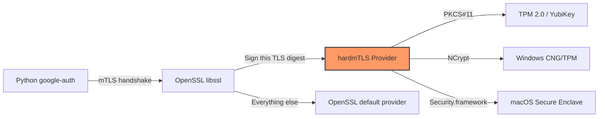

# Security Analysis: Does WIF Bunker Roll Its Own Crypto?

> **Analysis date:** August 8, 2026
> **Performed by:** AI-assisted review (Google Antigravity) with human oversight by Jay Lee
> **Scope:** hardmTLS OpenSSL provider (Rust), WIF Bunker Python application, certificate lifecycle, attestation subsystem

## Executive Summary

**No, WIF Bunker does not roll its own cryptography** — but it does roll its own *plumbing* between established crypto systems, and that plumbing carries real risk. The "don't roll your own crypto" axiom is not violated in spirit: no custom ciphers, key derivation functions, or signature algorithms are invented. However, the project does introduce a custom OpenSSL provider (hardmTLS) that sits in the critical path of every TLS handshake, and that integration layer is where the actual risk lives.

---

## What hardmTLS Actually Does

hardmTLS is a Rust OpenSSL 3.x provider that registers itself as `"hardmtls"` and intercepts two operation types:



It implements exactly two OpenSSL operation categories:

| Operation | What hardmTLS does | What OpenSSL still handles |
|---|---|---|
| **KEYMGMT** (RSA, EC) | Stores a function pointer + public key metadata. Blocks `export` (returns 0). | All other key management, including the TLS session keys |
| **SIGNATURE** (RSA, ECDSA) | Buffers digest bytes, passes them to the hardware callback | All encryption, decryption, key exchange, TLS record layer, certificate verification |

> [!IMPORTANT]
> hardmTLS **does not** implement any cipher, hash, KDF, DRBG, key exchange, or MAC operation. The OpenSSL `default` provider handles 100% of symmetric crypto, AEAD, key derivation, and random number generation. hardmTLS only touches the private-key signing path.

---

## Crypto Operation Audit

### Rust Side (hardmTLS)

| Category | Custom? | Details |
|---|---|---|
| Signing algorithms (RSA-PSS, ECDSA) | ❌ No | Delegates to hardware via PKCS#11 / NCrypt / Security.framework |
| Key generation | ❌ No | Cannot generate keys — requires pre-existing hardware keys |
| Encryption / Decryption | ❌ No | Not implemented (not in scope) |
| Random number generation | ❌ No | Not implemented |
| TLS protocol state machine | ❌ No | Handled entirely by OpenSSL libssl |
| Hash / digest computation | ❌ No | OpenSSL computes the digest; hardmTLS receives the final TBS bytes |
| ECDSA raw→DER encoding | ⚠️ Structural | Converts `r \|\| s` bytes to ASN.1 DER using OpenSSL `BigNum` + `EcdsaSig` — no math, just formatting |
| Key metadata (security bits) | ⚠️ Lookup table | Maps RSA key sizes → NIST SP800-57 security levels (hardcoded table) |

### Python Side (WIF Bunker)

| Category | Custom? | Details |
|---|---|---|
| Workload private key generation | ❌ No | 100% hardware-delegated (TPM, YubiKey PIV, Secure Enclave) |
| Ephemeral CA key generation | ⚠️ Software | Uses `cryptography` library's `generate_private_key()` — not custom, but software-only |
| Ephemeral CA cert signing | ⚠️ Software | Uses `cryptography` library's `CertificateBuilder.sign()` — standard X.509 signing |
| Attestation chain verification | ❌ No | Uses `pyOpenSSL` X509StoreContext (Linux/Windows) or `cryptography` `pub.verify()` (YubiKey) |
| mTLS handshake signing | ❌ No | Delegated to hardmTLS → hardware |
| Token exchange (STS) | ❌ No | Standard HTTPS POST to `sts.mtls.googleapis.com` via `google-auth` |

---

## Risk Assessment

### 🟢 Low Risk: "Rolling Your Own Crypto" — Not Happening

hardmTLS invents zero cryptographic primitives. Every signing operation is performed by vetted hardware (TPM 2.0 / YubiKey / Secure Enclave) or vetted software (OpenSSL / `cryptography` library). The "don't roll your own crypto" warning is specifically about inventing algorithms, implementing ciphers, or devising protocols. None of that happens here.

### 🟡 Medium Risk: Custom OpenSSL Provider Integration

This is where the real risk lives. hardmTLS implements the OpenSSL 3.x Provider API — a complex C ABI with dozens of callbacks, lifetime requirements, and subtle contracts. Getting any of these wrong can cause:

| Risk | Severity | Mitigation in Place |
|---|---|---|
| **Provider callback returns wrong metadata** (key size, max sig size) | 🟡 Medium | OpenSSL may allocate undersized buffers → crash or truncated signatures. Tests exist (`digest_sign_e2e.rs`, `mtls_handshake.rs`) but coverage of edge cases is unknown. |
| **`keymgmt_export` returns data instead of 0** | 🔴 High (if it happened) | Would allow OpenSSL to extract "private key" material into default provider. Currently hardcoded to return 0 — correct. |
| **`keymgmt_match` always returns 1** | 🟡 Medium | Skips cert/key matching validation. Correct by design (hardware guarantees the match), but if the cert and key got out of sync, OpenSSL wouldn't catch it — the TLS handshake would fail at the server. |
| **`signature_digest_verify_*` stubbed to return 0** | 🟢 Low | hardmTLS is sign-only; verification is done by OpenSSL's default provider. The stubs prevent accidental use. |
| **TBS buffer handling** | 🟡 Medium | Custom buffer management in `signature_digest_sign_update/final`. Memory safety is Rust-enforced, but logical bugs (e.g., not clearing buffer between operations) could leak cross-session data. |
| **Unsafe FFI boundary** | 🟡 Medium | The provider uses `unsafe` Rust to interface with OpenSSL's C API. Memory corruption bugs are possible at the FFI boundary despite Rust's safety guarantees for non-`unsafe` code. |

### 🟡 Medium Risk: Ephemeral CA is Software-Only

The ephemeral CA private key in [`cert.py`](file:///Users/jay/Documents/wif-bunker/repo/wif_bunker/cert.py#L67-L114) is generated in Python memory using `cryptography.generate_private_key()`. This key:

- **Exists only in RAM** — never written to disk
- **Signs exactly two certificates** — the CA self-signed cert and the workload cert
- **Is discarded** after the signing operation

The risk: if the process memory is compromised during `wif-bunker setup`, an attacker could extract the ephemeral CA key, forge a workload certificate for a different key, and impersonate the workload to GCP. However:

- The CA is only trusted by the specific WIF pool/provider being configured
- The `attributeCondition` on the WIF provider pins the expected certificate serial and/or SHA-256 fingerprint
- The window of exposure is seconds (during `setup` only, not during normal operation)
- This is the same pattern used by Google's own [enterprise certificate proxy documentation](https://cloud.google.com/iam/docs/workload-identity-federation-with-x509-certificates)

### 🟢 Low Risk: No Custom TLS Protocol

hardmTLS does not implement any TLS protocol logic. The TLS state machine, cipher suite negotiation, record layer encryption, key schedule, and certificate verification are all handled by OpenSSL's libssl. hardmTLS only provides a signing callback — it's analogous to plugging a PKCS#11 token into OpenSSL, which is a well-established pattern.

### 🟡 Medium Risk: PKCS#11 PIN Handling

The user's PKCS#11 PIN (for TPM or YubiKey) flows through:

```
certificate_config.json (on disk, mode 0600)
    → hardmTLS reads it → passes to cryptoki session.login()
```

The PIN is stored in a JSON file on disk. While the file permissions are restrictive (0600), this is inherently less secure than prompting for the PIN at connection time. This is a deliberate usability tradeoff — the WIF Bunker is designed for unattended server workloads, not interactive use.

---

## Are We Giving Users a False Sense of Security?

### What Users Might Assume
> "My private key is in a TPM/YubiKey, so it can never be stolen."

### What's Actually True
✅ The **workload private key** genuinely never leaves the hardware security boundary. hardmTLS provably cannot extract it — `keymgmt_export` returns 0, and the signing backends only receive digests and return signatures.

✅ Even if the machine is fully compromised, the attacker cannot exfiltrate the private key to use elsewhere.

### What Users Might Not Realize

⚠️ **Compromise of the running process** still allows an attacker to:
1. **Use** the key (sign arbitrary digests via the TPM/YubiKey while the process is running)
2. **Impersonate** the workload to GCP for as long as they maintain access
3. **Read** whatever GCP resources the workload identity has access to

This is not a WIF Bunker limitation — it's inherent to all HSM/TPM-backed credential systems. The key can't be stolen, but it can be *used* by a sufficiently privileged attacker. This is genuinely better than a JSON service account key (which can be exfiltrated and used from anywhere, forever), but it's not magic.

⚠️ **The ephemeral CA** is a software key. During `setup`, compromise of the process could allow forging certificates. After setup, the CA key no longer exists.

⚠️ **The PKCS#11 PIN** is stored in a file. Anyone with read access to `certificate_config.json` can send signing requests to the TPM/YubiKey. This is by design for unattended workloads.

---

## Comparison to Alternatives

| Approach | Key Exfiltration | Key Use While Compromised | Credential Portability |
|---|---|---|---|
| **JSON Service Account Key** | Trivial (copy the file) | Yes | Anywhere, forever |
| **WIF Bunker + TPM/YubiKey** | Impossible (hardware-bound) | Yes (while attacker has access) | Only on this machine |
| **WIF Bunker + Secure Enclave** | Impossible (hardware-bound) | Yes (while attacker has access) | Only on this machine |
| **GCE metadata service** | N/A (no persistent key) | Yes (while attacker has access) | Only on this VM |

WIF Bunker provides the same security posture as GCE's metadata service but for **non-GCE machines**. That's the actual value proposition.

---

## Verdict

| Question | Answer |
|---|---|
| Does WIF Bunker invent crypto algorithms? | **No** |
| Does hardmTLS implement ciphers/hashes/KDFs? | **No** |
| Does it replace OpenSSL's crypto? | **Only the private-key signing path** — everything else stays in OpenSSL's default provider |
| Is the OpenSSL provider integration risky? | **Yes, moderately** — the OpenSSL 3.x Provider API is complex and subtle |
| Is the ephemeral CA a weakness? | **Minor** — software key exists briefly in RAM during setup only |
| Is this a false sense of security? | **No** — the security claims (non-exportable keys, hardware-bound credentials) are genuinely true. The remaining attack surface (use-while-compromised) is inherent to all HSM systems and should be documented. |

> [!TIP]
> The project would benefit from explicit user-facing documentation that explains: "WIF Bunker protects against key *exfiltration*, not against key *use* by a compromised process." This sets accurate expectations.
